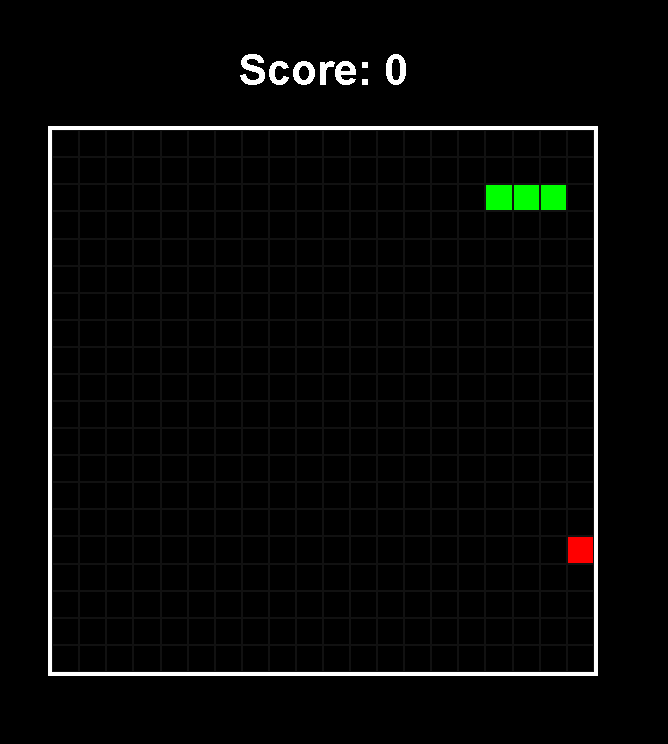

# Snake-game
Classic Snake Game built with HTML, CSS, and JavaScript featuring score tracking, collision detection, and restart functionality.

# 🐍 Snake Game

A classic Snake Game built using **HTML, CSS, and JavaScript** with smooth movement, food collision, score tracking, wall detection, self collision detection, and restart functionality.

---

# 🎮 Preview

## Game Screenshot



---

# ✨ Features

✅ Smooth Snake Movement
✅ Keyboard Controls
✅ Random Food Generation
✅ Score Tracking System
✅ Wall Collision Detection
✅ Self Collision Detection
✅ Restart Button After Game Over
✅ Dynamic Board Creation

---

# 🛠️ Technologies Used

* HTML5
* CSS3
* JavaScript (ES6)

---

# 🎯 How to Play

| Key            | Action     |
| -------------- | ---------- |
| ⬆️ Arrow Up    | Move Up    |
| ⬇️ Arrow Down  | Move Down  |
| ⬅️ Arrow Left  | Move Left  |
| ➡️ Arrow Right | Move Right |

### Rules

* Eat the food to grow the snake.
* Avoid colliding with walls.
* Avoid colliding with your own body.
* Try to achieve the highest score possible.

---

# 📂 Project Structure

```bash
Snake-Game/
│
├── index.html
├── style.css
├── script.js
└── README.md
```

---

# 🚀 Installation

## Clone Repository

```bash
git clone https://github.com/your-username/Snake-Game.git
```

## Open Project

```bash
cd Snake-Game
```

## Run

Open `index.html` in your browser.

---

# 🧠 Concepts Practiced

* DOM Manipulation
* Arrays
* Event Listeners
* setInterval()
* Collision Detection
* Dynamic HTML Creation
* Keyboard Controls
* Game Logic

---

# 🔮 Future Improvements

* Mobile Controls
* Sound Effects
* High Score System
* Difficulty Levels
* Pause Button
* Better UI Design
* Animations

---

# 👨‍💻 Author

**Aditya Soreng**

BSc IT Student | Frontend Developer | Learning JavaScript & React

---

# ⭐ Support

If you like this project:

⭐ Star the repository
🍴 Fork the project
🚀 Share it with others

---

# 📜 License

This project is open-source and available.
